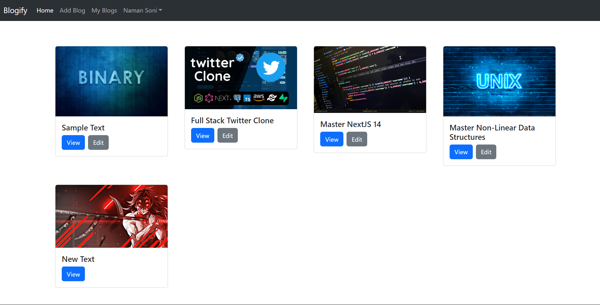
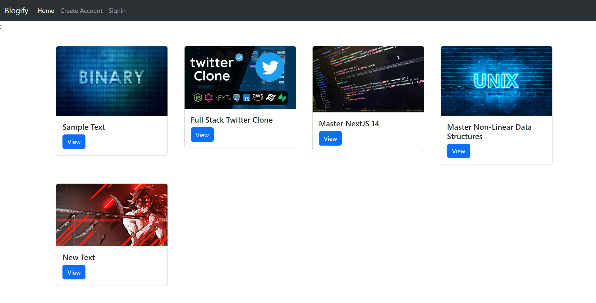

# Blogify

Blogify is a Full Stack Blog Application built using ReactJS, NodeJS, ExpressJS, MongoDB, and RestAPI. This application allows users to add, edit, and comment on blogs.

## Features

- **User Authentication**: Secure login and registration for users.
- **Create & Edit Blogs**: Users can create and edit their own blogs.
- **Comment on Blogs**: Users can comment on blogs.
- **Responsive Design**: The application is responsive and works on different devices.

## Technologies Used

- **Frontend**: ReactJS, CSS
- **Backend**: NodeJS, ExpressJS, MongoDB, Mongoose
- **API**: RESTful API


## Screenshots




## Project Structure

The project has the following structure:

    root
    │   README.md
    │   package.json
    │   ...
    └───frontend
    │   └───src
    │       └───components
    │       └───pages
    │       └───...
    └───backend
        └───controllers
        └───models
        └───routes
        └───...

## Getting Started

### Prerequisites

- Node.js
- MongoDB

### Installation

1. Clone the repository:
    ```sh
    git clone https://github.com/your-username/your-repository.git

2. Navigate to the backend directory and install dependencies:
    ```sh
    cd backend
    npm install

3. Navigate to the frontend directory and install dependencies:
    ```sh
    cd ../frontend
    npm install


4. Create a \`.env\` file in the backend directory and add your MongoDB URI and other environment variables:
    ```sh
    MONGODB_URI=your_mongodb_uri
    PORT=8000

### Running the Application

1. Start the backend server:
    ```sh
    cd Backend
    npm run dev

Open Another Terminal..

2. Start the frontend development server:
    ```sh
    cd Frontend
    npm run dev

3. Open your browser and navigate to
    ```sh
     http://localhost:5173


## Contributing

Feel free to fork this repository and submit pull requests. For major changes, please open an issue first to discuss what you would like to change.
